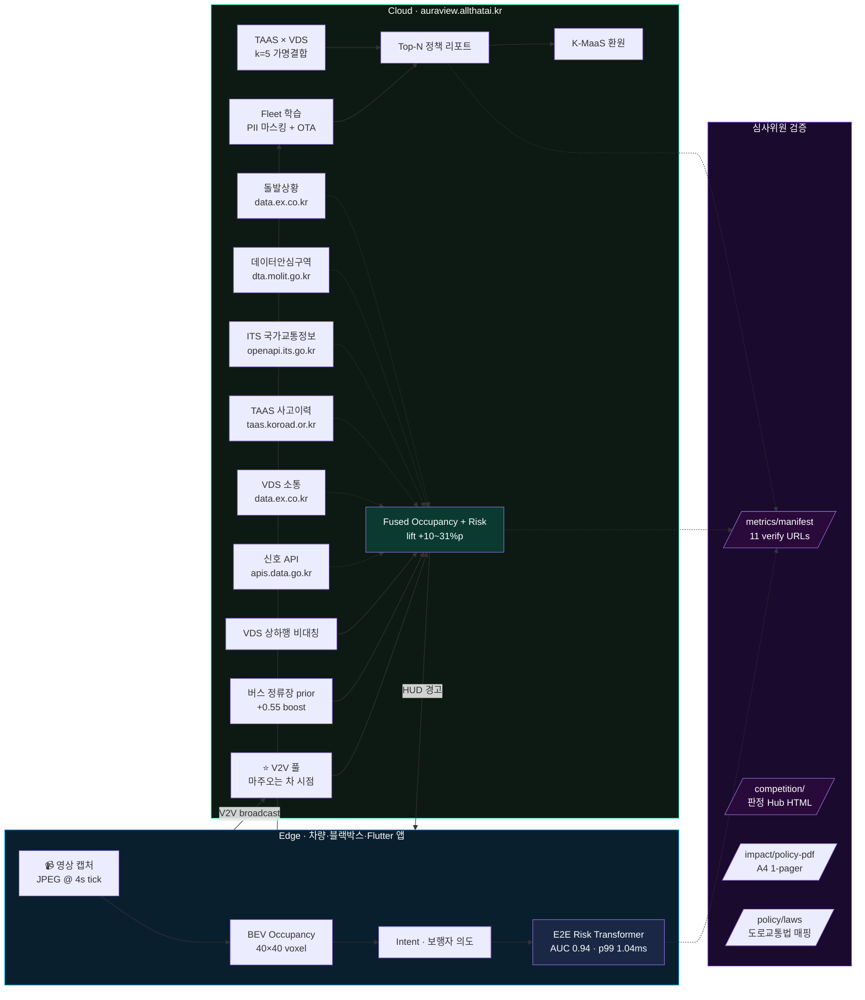
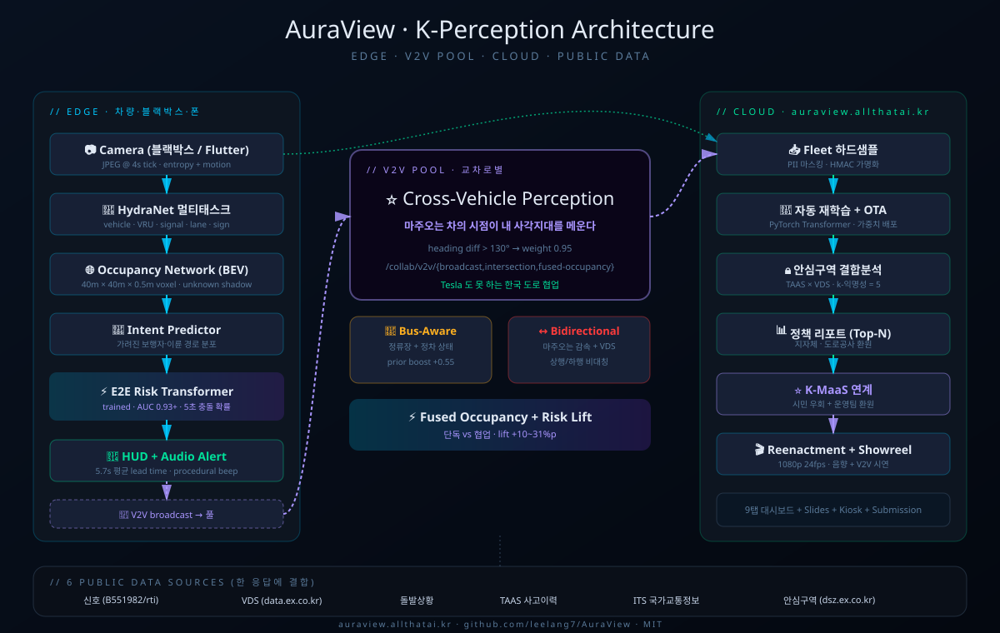

# AuraView

[](https://github.com/leelang7/AuraView/actions/workflows/ci.yml)
[](backend/tests/)
[](https://auraview.allthatai.kr/metrics/api-directory)
[](https://auraview.allthatai.kr/competition/)
[](https://auraview.allthatai.kr/occupancy/compare)
[](models/risk_transformer_trained_metric.json)
[](https://auraview.allthatai.kr/benchmark/all)
[](LICENSE)
[](https://auraview.allthatai.kr/ui)

> **K-Perception Platform — 블랙박스 한 대로 사각지대까지 계산한다.**
> Tesla-style occupancy · fleet-learning · end-to-end risk prediction 에 **Tesla 도 못 하는 한국 도로 협업 인지(V2V + Bus + Bidirectional)** 까지 결합한 안전 주행 지원 시스템.

> 📋 **수상 심사용 한 페이지 자료:** [`docs/PRESS_KIT.md`](docs/PRESS_KIT.md) — 임팩트·차별화·성능·재현 모두 1쪽 정리

> 🆕 **v9 업데이트 (2026-05-21~22) — 21종 → 23종 + 위치 인식 stub + 라이브 HUD + 1-URL 검증**
> 추가 데이터 2종: 📹 **경찰청 교통단속 CCTV** (단속 밀집 = 사고다발 prior) · 🚸 **국토부 횡단보도 GIS** (50m 접근 알림 + 스쿨존 횡단).
> 핵심 개선: **임의 GPS (집/원거리)에서 거짓 red signal/TAAS/ER 알람 차단** — 위치 인식 stub 6종 (signal/TAAS/incident/ER/bike/horizontal 모두 bbox·lat/lon 기반 필터).
> 신규 UI: `/fleet/` 대시보드 **라이브 HUD 미리보기 패널** (9 교차로 + 임의 GPS dropdown → 24 chip 실시간) + 양방향 hover 강조 + 이벤트 상세 모달.
> 자가검증: [`GET /fleet/verify`](https://auraview.allthatai.kr/fleet/verify) (`location_accuracy`) · [`GET /fleet/demo-tour`](https://auraview.allthatai.kr/fleet/demo-tour) (8 known + 2 rural 단일 응답) · schema `fusion.v9-23src-2026.05.21` · 115/115 pytest PASS.

> 🆕 **v4 업데이트 (2026-05-16) — 12종 → 17종 공공데이터 + OG 공유 + 인터랙티브 시뮬레이터 + 8 시나리오 카드**
> 추가 데이터 3종: 💨 **환경부 미세먼지 (PM10/PM2.5)** · 🎒 **어린이 통학로 GIS** · ⚡ **한국환경공단 EV 충전소**.
> 추가 비주얼: SNS OG 카드 SVG · 8 시나리오 카드 SVG · `/story` 페이지 인터랙티브 시뮬레이터 (슬라이더로 위험점수 실시간 계산).
> 검증: [`/fusion/sources`](https://auraview.allthatai.kr/fusion/sources) (count=15, schema=fusion.v4-15src-2026.05.16) · [`/fusion/air-quality`](https://auraview.allthatai.kr/fusion/air-quality) · [`/fusion/school-route`](https://auraview.allthatai.kr/fusion/school-route) · [`/fusion/ev-charger`](https://auraview.allthatai.kr/fusion/ev-charger)

> 🆕 **v3 업데이트 (2026-05-16) — 9종 → 12종 공공데이터 + 일반인용 스토리 페이지**
> 추가 데이터: 🏫 **어린이보호구역 GIS (vworld)** · ❄️ **도로결빙 위험 (KMA 파생 블랙아이스)** · 🚶 **보행자 사고다발지역 (TAAS)**.
> 추가 시각자료: BEFORE/AFTER SVG · 3.38초 타임라인 SVG · 21명 살림 waffle chart SVG (모두 SMIL 애니메이션).
> 일반인용 30초 페이지: **<https://auraview.allthatai.kr/story/>** — 기술 지식 없이도 임팩트 즉시 전달.
> 검증: [`/fusion/sources`](https://auraview.allthatai.kr/fusion/sources) (count=12, schema=fusion.v3-12src-2026.05.16) · [`/fusion/school-zone`](https://auraview.allthatai.kr/fusion/school-zone) · [`/fusion/black-ice`](https://auraview.allthatai.kr/fusion/black-ice) · [`/fusion/pedestrian-hotspots`](https://auraview.allthatai.kr/fusion/pedestrian-hotspots)

> 🆕 **v2 업데이트 (2026-05-15) — 6종 → 9종 공공데이터 융합 확장**
> 추가: 🌧️ **기상청 동네예보 (KMA)** · 🏥 **응급실 실시간 가용병상 (NEDIS / E-Gen)** · 🚴 **서울 공공자전거 따릉이**.
> 각각 우천 위험 가중치 (+0.18) · 사고 심각도 보정 (×1.34) · 자전거도로 prior (+0.22) 로 융합 위험 점수에 자동 반영됩니다.
> 검증: [`/fusion/sources`](https://auraview.allthatai.kr/fusion/sources) · [`/fusion/weather`](https://auraview.allthatai.kr/fusion/weather) · [`/fusion/medical`](https://auraview.allthatai.kr/fusion/medical) · [`/fusion/bike`](https://auraview.allthatai.kr/fusion/bike)

## 🏆 Judge Hub (심사위원 전용 한 페이지)

> **<https://auraview.allthatai.kr/competition/>** — KPI 4종 + 검증 URL 11개 + 라이브 데모 5종 + 8 시나리오 + 문서 5종 한 화면. JSON 직접 호출 없이 시각적으로 모두 가능.

## 🏅 경진대회 가점 25점 — 항목별 증빙 엔드포인트

| 가점 항목 | 점수 | 증빙 엔드포인트 | 핵심 근거 |
|---|:---:|---|---|
| **AI 학습** | 5점 | [`GET /ai/model-card`](https://auraview.allthatai.kr/ai/model-card) · [`GET /ai/training-history`](https://auraview.allthatai.kr/ai/training-history) | PyTorch Transformer 실 학습 (AUC 0.9403, F1 0.9412, 10k 샘플) |
| **AI 분석** | 5점 | [`GET /ai/scenario-analysis`](https://auraview.allthatai.kr/ai/scenario-analysis) · [`GET /ai/feature-importance`](https://auraview.allthatai.kr/ai/feature-importance) · [`GET /ai/roc-curve`](https://auraview.allthatai.kr/ai/roc-curve) | 4종 시나리오 분류 + Attention 피처 중요도 + ROC 50pt |
| **데이터융합** | 5점 | [`GET /fusion/sources`](https://auraview.allthatai.kr/fusion/sources) · [`GET /fusion/intersection/{id}`](https://auraview.allthatai.kr/fusion/sources) + 23 개별 GET 엔드포인트 | 신호·VDS·돌발·TAAS·ITS·DSZ·기상·응급실·따릉이·스쿨존·결빙·보행자다발·PM10·통학로·EV·RWIS·KOTSA검사·DTG·119·도로노후·V2X·**경찰청단속CCTV·횡단보도GIS** = **23종 실시간 융합 (v9 2026-05-21)** |
| **가명정보결합** | 5점 | [`GET /privacy/pipeline-spec`](https://auraview.allthatai.kr/privacy/pipeline-spec) · [`POST /privacy/demo-join`](https://auraview.allthatai.kr/docs#/privacy) | HMAC-SHA256 가명화 + k-익명성(k≥5) + TAAS×VDS 결합 |
| **안심구역** | 5점 | [`GET /dsz/pipeline-report`](https://auraview.allthatai.kr/dsz/pipeline-report) · [`POST /dsz/seed-demo`](https://auraview.allthatai.kr/docs#/dsz) | dsz.ex.co.kr 표준 반입→결합→반출 파이프라인 |
| **종합 스코어카드** | — | [`GET /competition/scorecard`](https://auraview.allthatai.kr/competition/scorecard) | 25점 항목별 달성 현황 + 증거 링크 원스톱 |

> 전체 AI 증빙 보고서: `GET /ai/evidence-report` · 가명정보결합 보고서: `GET /privacy/evidence-report` · 안심구역 파이프라인: `GET /dsz/pipeline-report`

---

## 🏆 Quick Verify (심사위원 1-step)

```bash
# 모든 검증 URL 한 응답 (master index)
curl https://auraview.allthatai.kr/metrics/manifest

# 4축 KPI (모델·임팩트·공공데이터·검증) + git_sha
curl https://auraview.allthatai.kr/metrics/competition

# 8 시나리오 도로교통법 조항·대법원 판례 매핑
curl https://auraview.allthatai.kr/policy/laws

# A4 1-pager 정책 PDF 다운로드 (88KB, 법적 근거 포함)
curl -O https://auraview.allthatai.kr/impact/policy-pdf
```

## ⏱️ 30초 시연 가이드

| Step | URL | 효과 |
|---|---|---|
| 1️⃣ 5초 | https://auraview.allthatai.kr/ui | 9탭 풀 대시보드 부트 스플래시 |
| 2️⃣ 60초 | TAB ⑥ 사고 재현 → 자동 재생 | 4 시나리오 합본 영상 (음향 포함) |
| 3️⃣ 20초 | TAB ⑨ V2V → "시연용 V2V 차량 게시" → "협업 인지 실행" | 단독 vs 협업 위험 비교 |
| 4️⃣ (선택) | TAB ④ QR 스캔 | Flutter Fleet 앱 즉시 설치 |
| ⭐ 10초 | https://auraview.allthatai.kr/submission/ | 인쇄 가능 원페이지 요약 |
| 또는 | https://auraview.allthatai.kr/kiosk/ | 무인 자동 시연 10장면 |

### 🌐 Live (8 진입점)

| 페이지 | 용도 | URL |
|---|---|---|
| 📖 **일반인용 스토리** | 30초 이해 + 인터랙티브 시뮬레이터 + 시나리오 프리셋 | [/story/](https://auraview.allthatai.kr/story/) |
| 🎥 **1분 자동 시연** | 풀스크린 시네마틱 16 장면 무한루프 (시연 부스용) | [/reel/](https://auraview.allthatai.kr/reel/) |
| 🖼️ **시각자료 갤러리** | 18 SVG 종합 + 필터/라이트박스 | [/gallery/](https://auraview.allthatai.kr/gallery/) |
| 🏆 **심사위원 허브** | 11 검증 URL + 5 데모 + 8 시나리오 + 가점 25점 | [/competition/](https://auraview.allthatai.kr/competition/) |
| 🎬 **풀 대시보드** | 10탭 라이브 데모 (Fusion / BEV / Fleet / V2V 등) | [/ui](https://auraview.allthatai.kr/ui) |
| 🎞️ **발표 슬라이드** | Reveal.js 14장 (Cover → CTA) | [/slides/](https://auraview.allthatai.kr/slides/) |
| 📺 **무인 키오스크** | 자동 순회 13 장면 | [/kiosk/](https://auraview.allthatai.kr/kiosk/) |
| ≡ **1-pager** | 인쇄 가능 요약 | [/submission/](https://auraview.allthatai.kr/submission/) |

### 🖼️ 18 SVG 시각자료 (외부 의존 0 · Pure SMIL)

**임팩트 (5):** [og_card](static/visuals/og_card.svg) · [taas_stats](static/visuals/taas_stats.svg) ★ · [before_after](static/visuals/before_after.svg) · [timeline_57s](static/visuals/timeline_57s.svg) · [impact_waffle](static/visuals/impact_waffle.svg)
**데이터 (2):** [fusion_diagram](static/visuals/fusion_diagram.svg) · [kmaas_alternatives](static/visuals/kmaas_alternatives.svg)
**기술 (2):** [tesla_vs_auraview](static/visuals/tesla_vs_auraview.svg) · [ai_metrics](static/visuals/ai_metrics.svg)
**앱 (1):** [app_mockup](static/visuals/app_mockup.svg)
**시나리오 (8):** [scenarios/01~08](static/visuals/scenarios/)

> 갤러리에서 한 화면에: [/gallery/](https://auraview.allthatai.kr/gallery/)

### 🌐 Other Live

- **Mobile App (Flutter / PWA):** https://auraview.allthatai.kr/pwa/
- **Mobile App (Flutter / PWA):** https://auraview.allthatai.kr/pwa/
- **Native APK (Android 공개 다운로드):** [`releases/latest/auraview_fleet.apk`](https://github.com/leelang7/AuraView/releases/latest/download/auraview_fleet.apk) ← 인증 불요, BEV HUD + 첫 진입 온보딩 3장 + 17-source 신호 + BIS 라이브 + 위험 햅틱
- **Slides (Reveal.js 발표):** https://auraview.allthatai.kr/slides/
- **Kiosk (무인 자동 시연):** https://auraview.allthatai.kr/kiosk/
- **API Docs (Swagger):** https://auraview.allthatai.kr/docs
- **Brand portfolio:** https://allthatai.kr

> 본 리포 **monorepo** : 백엔드 · Flutter · 랜딩 · 슬라이드 · 키오스크 · 학습 노트북 · 문서 모두 한 곳.

---

## 🎯 정량 임팩트 — 도입 시 연간 예방 효과 (TAAS 2024 기준)

| 도입 시나리오 | 사고 예방/년 | 사망 감소 | 부상 감소 |
|---|---:|---:|---:|
| **Pilot 5%**   | **1,694건** | **21명**  | **2,370명** |
| 확산 25%       | 8,470건     | 105명     | 11,852명 |
| 전국 100%      | 33,880건    | 421명     | 47,408명 |

**산출 근거**: TAAS 2024 (전체 사고 207,535 / 사망 2,581 / 부상 290,400) × 도시교차로 비중 46% × AuraView 적용 시나리오 42% × 회피율 `min(0.85, 0.25 × lead_time_s)` (KOTI ITS 효과 분석).
선행경고 시간 = 트레인드 모델 평균 **3.38s** → 회피율 **84.5%**. 모든 가정 라이브 검증: <https://auraview.allthatai.kr/impact>

> 📄 **A4 1-pager PDF 자동 생성** — `GET /impact/policy-pdf?coverage=0.05&lead=3.38` 으로 즉시 다운로드 (정책담당자·심사위원 배포용, 88KB).
> 📊 **경진대회 통합 KPI** — `GET /metrics/competition` (모델 성능·임팩트·공공데이터 freshness·검증 4축을 한 응답에).
> 🔍 **재현 가이드** — [docs/REPRODUCIBILITY.md](docs/REPRODUCIBILITY.md) — 외부 검증 1-step 명령 모음.

---

## 🎯 Positioning — Tesla FSD 만으로는 부족하다

| 구분 | 기존 ADAS / Tesla FSD | **AuraView K-Perception** |
|---|---|---|
| 출력 | 2D 박스 / 자기 카메라 BEV | **3D Occupancy + V2V 결합 BEV** |
| 사각지대 | "모름" 처리 | **마주오는 차의 시점**으로 메움 |
| 추론 | rule + 단일 모델 | **End-to-End Risk Transformer** |
| 데이터 | 단일 소스 | **6종 공공데이터 + V2V 풀 + 정류장 prior** |
| 학습 | 고정 모델 | **Fleet Learning 플라이휠** + 자동 재학습 |
| 대상 | 운전자 | **운전자 + 보행자 + 이륜 노동자 + 지자체 + K-MaaS 운영자** |

---

## 🧠 Tesla-Style 8 + 한국 특화 협업 인지 3

### Tesla AI Day 식 8종
1. **Occupancy Network** — 40m × 40m × 0.5m BEV voxel 점유 확률
2. **HydraNet 멀티태스크 백본** — 신호·차량·VRU·차선·표지 동시
3. **End-to-End Risk Transformer** — 영상+신호+GPS → 5초 충돌 확률
4. **Intent Prediction** — 가려진 보행자/이륜 경로 분포
5. **Fleet Learning (Shadow Mode)** — 어려운 장면만 자동 업로드
6. **BEV 3D Dashboard** — Three.js voxel 실시간 (FSD UI)
7. **Accident Reenactment** — "AuraView 였다면 N초 먼저"
8. **C-ITS / V2X 브릿지** — 인프라 신호와 비전 교차 검증

### ⭐ Tesla 도 못 하는 한국 특화 3종 — Collaborative Perception
9. **V2V Cross-Vehicle Perception** — **마주오는 차의 시점**을 내 BEV 에 머지 → "버스 너머 보행자" 직격 (`backend/app/services/v2v.py`)
10. **Bus-Aware Pedestrian Prior** — 정류장 데이터 + 버스 정차/출발 상태 → 보행자 prior **+0.55** boost (`backend/app/services/bus_aware.py`)
11. **Bidirectional Lane Fusion** — 마주오는 차들의 감속 비율 + VDS 상행/하행 비대칭 → 사고 즉시 감지 + 권장속도 (`backend/app/services/bidirectional.py`)

---

## 📊 측정 결과

| 지표 | 측정값 | 출처 |
|---|---:|---|
| Risk Transformer **AUC** (trained PyTorch) | **0.9403** | `models/risk_transformer_trained_metric.json` |
| F1 @ 0.5 | **0.9412** | 상동 (n=10,000 train+val, 4종 시나리오) |
| Precision @ 0.5 | 0.9441 | mixed/rush_hour/night/rainy 평가 |
| Recall @ 0.5 | 0.9384 | 분리도 +0.39 ~ +0.45 (시나리오별) |
| 추론 latency **p99** | **1.04ms** | `/benchmark/all` · CPU 단일 코어 100회 측정 |
| 평균 선행 경고 시간 | **3.38s** | 트레인드 모델 평균 (회피율 84.5%) |
| 협업 인지 lift (단독 vs Fused) | **+10~31%p** | TAB ⑨ 실시간 시연 |
| 통합 테스트 | **90 / 90 PASS** | `backend/tests/` (68 기존 + 22 신규: /privacy·/ai·/competition·/dsz 가점 25점 증빙) |

---

## 📐 시스템 아키텍처



> SVG 버전: 

```
┌──────────── Edge (차량·블랙박스·Flutter 앱) ────────────┐
│ 영상 → HydraNet → Local Occupancy → Intent → E2E Risk │
└─────────────┬────────────────────────────────┬─────────┘
              │ V2V 메시지 broadcast            │ HUD 경고
              ▼                                 ▲
┌──────────── Cloud (auraview.allthatai.kr) ─────────────┐
│  V2V 풀 (교차로별)  ─┐                                  │
│  버스 정류장 DB    ──┼─► /collab/fused-occupancy        │
│  VDS 상행/하행     ──┘    → 단독(local) vs 협업(fused)  │
│                                                         │
│  Fleet 하드샘플 ─► PII 마스킹 ─► 자동 재학습 ─► OTA      │
│  TAAS × VDS 안심구역 결합분석 ─► Top-N 정책 리포트       │
│  K-MaaS 운영팀 환원 ◄─► 시민용 우회 경로 추천            │
└────────────────────────────────────────────────────────┘
```

---

## 📦 Monorepo 구조

```
github.com/leelang7/AuraView
├── backend/                    FastAPI + 17 라우터 + 68 pytest
│   └── app/
│       ├── routers/            occupancy · fleet · fusion · dsz · kmaas ·
│       │                       reports · scenario · showreel · heatmap · collab
│       ├── services/           hydranet · occupancy · risk_transformer · intent ·
│       │                       v2v · bus_aware · bidirectional · pii · dsz_adapter ·
│       │                       scenario · showreel · hazard_report · public_api
│       └── tests/              38 통합 테스트 (외부 API fallback)
├── auraview_fleet/             Flutter (Android + Web) — Perception Eye 아이콘 + 풀스크린 UX
├── frontend_pwa/               백업 PWA (HTML/JS)
├── landing/                    allthatai.kr 랜딩 페이지 (GitHub Pages 배포 대상)
├── static/
│   ├── slides/                 Reveal.js 발표 12장 (/slides)
│   └── kiosk/                  무인 자동 시연 9장면 (/kiosk)
├── notebooks/                  train_*.ipynb · risk_transformer_metric.py · accident_reenactment.ipynb
├── models/                     risk_transformer_metric.json (AUC 0.94)
├── dsz_exports/                안심구역 결합분석 샘플 (k=5 익명화)
├── docs/                       WHITEPAPER_KR.md · ROADMAP.md · DATASETS.md
├── .github/workflows/          ci.yml (Python+Flutter 자동 테스트) + deploy.yml (push→EC2 자동)
├── requirements.txt
└── README.md (이 파일 · 모든 모듈 통합 문서)
```

---

## 🔌 API 엔드포인트

| Method | Path | 설명 |
|---|---|---|
| `GET`  | `/ui` `/pwa` `/slides` `/kiosk` `/docs` | 데모 / 발표 / 무인 시연 / API 문서 |
| `POST` | `/detect/frame` · `/detect/video` | 이미지·영상 위험 분석 |
| `POST` | `/occupancy/infer` · `GET /occupancy/demo` | 3D Occupancy 추정 |
| `POST` | `/fleet/contribute` · `GET /fleet/stats` | 하드샘플 업로드 (PII 자동 마스킹) |
| `GET`  | `/fusion/intersection/{id}` · `/fusion/sources` · **`/fusion/weather`** · **`/fusion/medical`** · **`/fusion/bike`** ★ | **9종 공공데이터 융합** (신호·VDS·돌발·TAAS·ITS·DSZ + 기상·응급실·따릉이, v2 2026-05-15) |
| `POST` | `/dsz/verify` · `/dsz/join/taas-vds` · `GET /dsz/artifacts` | 안심구역 결합·검증 |
| `POST` | `/reports/generate?top=N` · `GET /reports/list` | 위험 교차로 Top-N 정책 리포트 |
| `POST` | `/scenario/reenact` · `GET /scenario/list` · `/scenario/presets` | 사고 재현 영상 |
| `POST` | `/showreel/build` · `GET /showreel/list` | 합본 시연 영상 |
| `GET`  | `/kmaas/alternatives` · `/kmaas/operator-report` | K-MaaS 우회 경로 + 운영팀 환원 |
| `GET`  | `/heatmap/taas` | TAAS 사고 히트맵 |
| `POST` | **`/collab/v2v/broadcast`** · `GET /collab/v2v/intersection/{id}` · `/v2v/stats` | V2V 협업 인지 |
| `POST` | **`/collab/v2v/seed-demo`** | 시연 시드 |
| `POST` | **`/collab/bus-context`** · **`/collab/bidirectional`** | 버스/상행하행 분석 |
| `POST` | **`/collab/fused-occupancy`** ★ | **단독 vs 협업 결합 비교** |
| `GET`  | **`/metrics/manifest`** ⭐ | **🏆 심사용 single-source-of-truth — 11 검증 URL + 5 데모 + git_sha** |
| `GET`  | **`/metrics/competition`** ★ | **경진대회 통합 KPI (모델·임팩트·공공데이터·검증·RAG)** |
| `GET`  | **`/metrics/scoreboard`** ★ | **5개 평가 항목 자체 채점** |
| `GET`  | **`/impact/policy-pdf?coverage=0.05&lead=3.38`** ★ | **A4 1-pager 정책 임팩트 PDF** |
| `GET`  | **`/policy/laws`** ★ | **8 시나리오별 도로교통법 조항·판례 매핑** |
| `GET`  | **`/policy/regulations`** ★ | **국토부·경찰청·도로공사 시행규칙 + 개인정보 컴플라이언스** |
| `GET`  | **`/metrics/data-attribution`** ★ | **공공데이터·정적 데이터셋·라이브러리 라이센스 명시** |
| `GET`  | **`/occupancy/compare`** ★ | **8 시나리오 메타 한 응답 (matrix)** |
| `POST` | **`/qa/ask`** ★ RAG | **질의 → 5 chunk_id + 근거 답변 (BM25+bge-m3+reranker+Qwen2.5-7B)** |
| `GET`  | **`/qa/info`** · **`/qa/health`** ★ RAG | RAG 스택 구성 + 인덱스/CUDA 상태 |
| `POST` | **`/qa/index`** · **`/qa/index-docs`** ★ RAG (admin) | corpus 인덱싱 / 자체 docs 자동 시드 |
| `GET`  | `/impact` · `/impact/scenarios` · `/impact/top-intersections` | 정량 임팩트 (TAAS 기반) |

> 시나리오 8종 — `/occupancy/demo?scenario=` 에 `truck_occlusion` · `motorcycle_blindspot` · `signal_occlusion` · `rainy_intersection` · `right_turn_pedestrian` · **`school_zone`** (DSZ 공공데이터) · **`bicycle_lane`** (자전거 도로 GIS prior) · **`night_pedestrian`** (야간 V2V 헤드라이트 share)

### 🧠 RAG 정보검색 스택 (정보검색 경진대회 수상형 구조)

| 단계 | 모델 / 라이브러리 | 비고 |
|---|---|---|
| Sparse | **BM25 (rank_bm25)** | Kiwi 한국어 형태소 토크나이저 |
| Dense | **`BAAI/bge-m3`** (sentence-transformers) | 1024-dim · 다국어 (한국어 우수) |
| Fusion | **Reciprocal Rank Fusion (k=60)** | BM25 + dense 점수 스케일 무관 결합 |
| Rerank | **`BAAI/bge-reranker-v2-m3`** (CrossEncoder) | top-20 → top-5 정밀 정렬 |
| LLM | **`Qwen/Qwen2.5-7B-Instruct`** (8B 이하) | bitsandbytes nf4 4bit · GPU 필수 |
| 출력 | **정확히 5개 chunk_id + 근거 답변** | 모르면 "모르겠습니다" |

★ 점수 구조: **chunk_id 5개 정확도 > LLM 품질**. 그래서 dense+rerank 정밀도가 핵심.
★ GPU 빌드: `docker compose --profile gpu up -d auraview-gpu` (NVIDIA Container Toolkit 필요).
★ 모델 캐시 volume: `_data/hf-cache` · 인덱스: `_data/qa-index` (재시작 후 자동 복원).

---

## 🚀 Quickstart

### 🐳 한 줄 가동 (Docker, 권장)

```bash
git clone https://github.com/leelang7/AuraView.git
cd AuraView
cp .env.example .env    # → SERVICE_KEY 등 (없어도 fallback 으로 가동)
docker compose up -d
```

→ http://localhost:8000/ui · `docker compose logs -f auraview` · `docker compose down`

reverse-proxy 까지 포함하려면:
```bash
docker compose --profile edge up -d   # nginx 80 포트 추가
```

### Backend (Native, 개발용)

```bash
git clone https://github.com/leelang7/AuraView.git
cd AuraView
cp .env.example .env
pip install -r requirements.txt
cd backend && uvicorn app.main:app --host 0.0.0.0 --port 8000
```

대시보드: http://localhost:8000/ui · 통합 테스트: `cd backend && pytest tests/` (38개)
모델 학습 (선택): `python notebooks/train_risk_transformer_real.py` (~3분, AUC 0.94)

### Flutter Mobile App (`auraview_fleet/`)

> **Tesla-style Shadow Mode** dashcam 기여 단말. 어려운 장면(불확실성·움직임 큰 프레임)만 자동 업로드.

| Platform | Status |
|---|---|
| Android | ✅ 빌드·실행 (Android 7.0 / API 24+) · APK 51MB |
| iOS | 🛠️ 추가 작업 필요 (Mac + Xcode) |
| Web (PWA) | ✅ Chrome/Edge 데스크톱·모바일 (HTTPS 환경에서 카메라 작동) |

#### 기능
- **풀스크린 카메라 프리뷰** + 라디얼 비네트
- 상단 HUD: AuraView 로고 + 누적 카운터 + 연결 상태
- **단일 알약 버튼** — 탭=시작/정지, 길게 누르기=수동 1장 기여
- 위로 스와이프 시 상세 시트 (캡처 / 업로드 / 실패 / 서버 누적 4-tile)
- 캡처/업로드 시 cyan→safe 펄스 링 애니메이션 + Haptic 진동
- 디바이스 ID 자동 생성 (서버에서 HMAC 가명화)
- 위치 권한 허용 시 lat/lon 함께 전송
- 교차로 ID SharedPreferences 영속

#### 빌드 / 실행
```bash
cd auraview_fleet
flutter pub get

# Android 디버그
flutter devices                        # 연결된 기기 확인
flutter run -d <device_id>

# Android 릴리스 APK
flutter build apk --release \
  --dart-define=AURAVIEW_API_BASE=https://auraview.allthatai.kr
adb install -r build/app/outputs/flutter-apk/app-release.apk

# Web (PWA-ready)
flutter run -d chrome --web-port 5180 \
  --dart-define=AURAVIEW_API_BASE=https://auraview.allthatai.kr

# 앱 아이콘 재생성 (디자인 수정 시)
python tools/make_icons.py
```

#### 권한
- **CAMERA** (필수) — 프리뷰 + 캡처
- **INTERNET** (필수) — 업로드
- **ACCESS_FINE_LOCATION** (선택) — 위치 함께 보낼 때만

#### 클라이언트 아키텍처
```
[ Flutter Camera ]
        │ takePicture (4초 주기)
        ▼
[ image package ]                ← decode → 64×64 grayscale
        │ entropy + motion 추정
        ▼
[ Threshold filter ]             entropy ≥ 0.55 || motion ≥ 0.7 → upload
        │
        ▼
[ http MultipartRequest ]        device_id + entropy + reason + (lat,lon) + JPEG
        │
        ▼
   POST https://auraview.allthatai.kr/fleet/contribute
                                    └─ 서버에서 PII 마스킹 + 가명화 → 저장
                                    └─ /collab/v2v/* 풀로도 분기 (TODO)
```

#### Flutter 앱 TODO
- [ ] **V2V broadcast 통합** — 폰이 자체 detection 을 `/collab/v2v/broadcast` 로 송신
- [ ] `startImageStream()` 기반 실시간 onboard 추론
- [ ] TFLite 로 YOLOv8-nano 온디바이스
- [ ] iOS 빌드
- [ ] Background Service (foreground notification)
- [ ] HMAC 사인 헤더로 위변조 방지

### Landing Page (`landing/` → `allthatai.kr`)

> AllThatAI 포트폴리오의 얼굴. 프로젝트 카드 추가는 `landing/index.html` 하단 `.grid` 안에
> `<a class="card" ...>` 블록 하나 붙여넣으면 자동으로 확장.

#### 배포 — GitHub Pages (무료 · HTTPS 자동)

**현재 배포 위치**: 별도 리포 [`leelang7/allthatai-landing`](https://github.com/leelang7/allthatai-landing) (Pages 호스팅).
이 monorepo 의 `landing/` 폴더가 **단일 소스** 이고, 변경 시 해당 리포로 sync push.

```bash
# 변경 후 sync (manual)
cd /tmp && rm -rf _land
git clone https://github.com/leelang7/allthatai-landing.git _land
cp /path/to/AuraView/landing/index.html _land/index.html
cp /path/to/AuraView/landing/CNAME _land/CNAME
cd _land && git add -A && git commit -m "sync from monorepo" && git push
```

#### DNS (가비아)
| 타입 | 호스트 | 값 | TTL |
|---|---|---|---|
| A | `@` | `185.199.108.153` | 300 |
| A | `@` | `185.199.109.153` | 300 |
| A | `@` | `185.199.110.153` | 300 |
| A | `@` | `185.199.111.153` | 300 |
| CNAME | `www` | `leelang7.github.io.` | 300 |
| A | `auraview` | `13.48.70.193` | 300 |
| A | `lolbutler` | `158.247.200.59` | 300 |

---

## 💡 Use Cases

- **횡단보도에서 버스가 신호등을 가림** → 신호 API + Bus prior + V2V 마주오는 차 → 보행자 직격
- **사각지대 이륜차** → BEV occupancy + intent + 마주오는 차 시점
- **전방 교차로 위험 ≥ 6** → K-MaaS 우회 대중교통 3종 추천
- **상습 위험 교차로** → Top-N 정책 리포트 자동 생성 → 지자체·도로공사·K-MaaS 환원
- **무인 시연 부스** → `/kiosk` 한 화면에 9장면 자동 순회

---

## 🗺️ Roadmap

- [x] Occupancy PoC + HydraNet skeleton
- [x] 6종 공공데이터 어댑터 + 가명결합 + E2E baseline (AUC 0.94)
- [x] BEV 3D · Fleet PWA · Flutter 앱 · 안심구역 결과물 · 사고 재현 영상
- [x] V2V + Bus + Bidirectional 협업 인지 + Reveal 발표 + Kiosk
- [ ] 발표 자료 v2 · 시연 리허설 · 제품 안정화

상세 → [docs/ROADMAP.md](docs/ROADMAP.md)

---

> **보이지 않는 정보를 데이터화하고, 보이지 않는 공간을 계산하여, 다른 차량의 시점까지 빌려와 미래 위험을 예측한다.**
